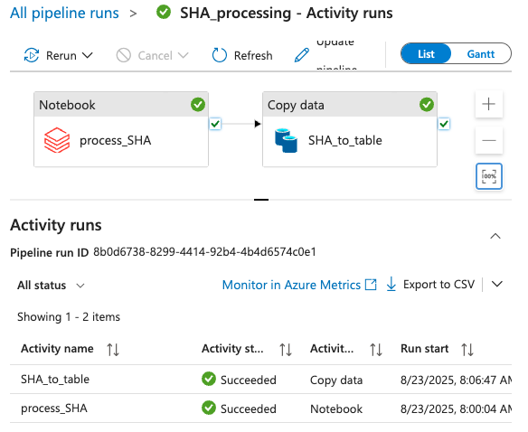

# Combination in Relational Database

Several steps are followed to generate a relational database

- **Automated-copy**: data is copied over from Dropbox to Azure Datalake using AzCopy scheduled with Microsoft Task Scheduler, using *upload_excels.bat* and *reset_list.bat*.
- **Automated-processing**: data is processed in Azure (code loaded in the Azure Databricks, automatically scheduled through Azure Data Factory, and once processed automatically integrated in an Azure SQL database (as shown in the Azure Data Factory screenshot below), using 9 *processing.py* scripts.
- **Automated_Combination**: combines all tables of the relational database in a single combined table (discarding data after last good session for exits or data from faulty sessions for issues), using *combine_tables.py*, which is the raw database. These 3 steps all proceed daily automated.

- **Stable_Calculations**: a selection of the data can be taken, data discarded according to additional quality criteria, data imputated, and dependent measures calculated, using *Stable_Database_Calculation.py*. This is done by calling this function periodically and manually, so this database is "stable" in between these runs. 
